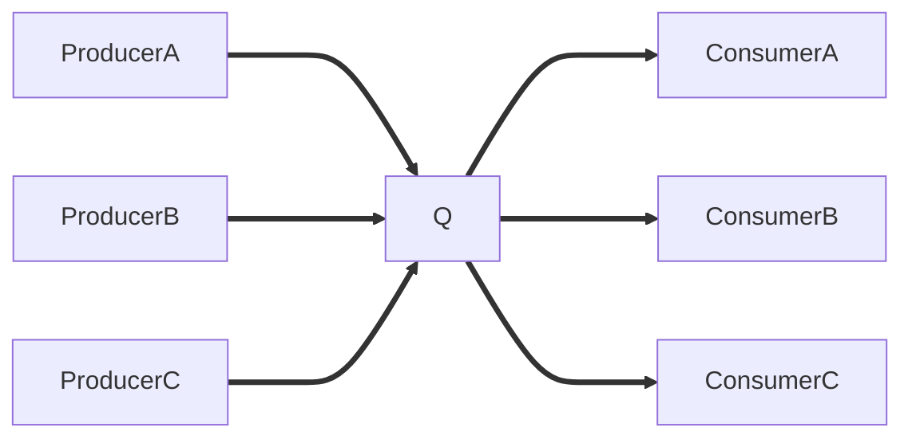
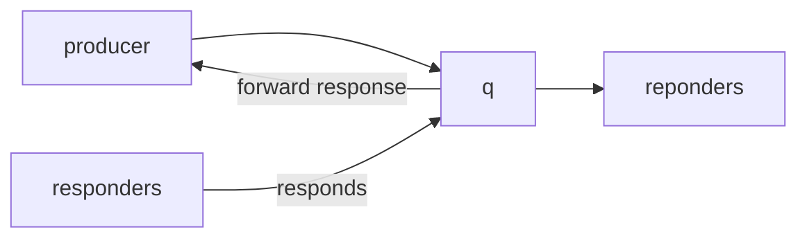
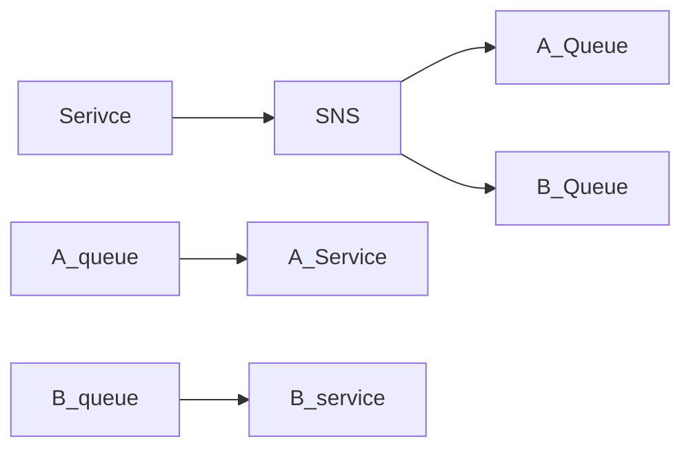

- AWS Reigons
- AWS Availability Zones
- IAM
	- Recommended using MFA
	- written in json
	![[Pasted image 20210803143842.png]]
	- Least Privlidge Principle
	- Federation
		- Uses the SAML Standard
	- Do not commit IAM credentials to code OR use ROOT account
- EC2
	- Renting virtual machines (EC2)
	- Storing data on virtual drives (EBS)
	- Distributing load across machines (ELB)
	- Scaling the services using an auto-scaling group (ASG)
	- User Data
		- When the instance is started you can pass User Data, This is used for bootstrap automation
			- make sure to start with the Bash shbang
	- instance launch types
		- On Demand (short/elastic workload, predictable prices)
			- Pay for what you use. per second billing. High Cost, no commitment
			- un-interupted workloads
		- reserved (1 year)
			- Traditional IT Model
			- Pay Upfront for long term (1-3 year commitment)
			- reserve a type, IE for a database.
			- long workloads
			- convertible reserved instances
			- can be scheduled
		- Spot Instancces
			- 90% discount to on-demand
			- can "lose" an instance at any point
			- set a max price for your workload
			- use for resiliant workloads **NOT** for critical jobs or database.
				- data analysis
				- image processing
				- batch jobs
		- Dedicated Instances
	- Elastic Network Interfaces
	
		represent a virtual network card. 
		has an IP4 address and MAC address
	- EC2 Hibernate
		an instance can hibernate up to 60 days
- High Availability
	Horizontal Vs. Vertical Scaling
	What is load balancing?
		[[EC2 Load Balancer]] 
		Health Checks - Determines if instances are responding to requests
		![[Pasted image 20210818113113.png]]
		If a reply is 200 OK an instance is healthy, health check can be conifgured
		SECURITY - Configure EC2 instances to allow access from load balancers 
		-  Network Load Balancer
				- Internet Facing
				- can exsist in multiple AZ's
				- targeting a grouop
				- Can be assigned an elastic IP (must be done at creation)
		- Application Load Balancer V2
				- Route based on path in url
				(example.com/users or example.com/post)
			- Additionally routing on query string and headers
			- port mapping feature
			![[Pasted image 20210824112817.png]]
			- can direct to lambda functions
			- Client IP information contained in x-forward- http headers
		- Classic Load Balancers (v1)
			- TCP (layer 4)
			- HTTP (layer 7)
			- Health cheack at either level
			- fixed hostname
		Stickiness - The client will continue to connect to the same instance behind the load balancer. Used to maintain session data. May cause an imablance. (duration up to 7days)
		Cross Zone Balancing - Each load balancer will distribute across all AZ's
		![[Pasted image 20210825105223.png]]
		SSL/TLS Certificates
			Secure Socket Layer - used to enctrypt connections
			Transport Layer Security - newer version, mainly used.
			Public certs and issued by Certificate Authorities
				- Comodo, Symntec, LetsEncrypt
				- Have an expiration date, must be re-newed regularly
			Load Balancers uses a X.509 cert.
			managed using AWS Cert Manager, where you can upload your own certs
			Server Name Indication - Solves the problem of loading multiple certificates onto one web server to server multiple websites
			Multiple Certs is supported by ALB and NLB (Not v1 classic)
		Connection Draining or Deregistration Delay
			Time to complete requests while un-healthy. Stop sending new requrests to the instance while de-registering
			![[Pasted image 20210825111212.png]]
			Disabled with value 0, max time 1 hour
			You and your colleague are working on an application that's interacting with some AWS services through making API calls. Your colleague can run the application on his machine without issues, while you get API Authorization Exceptions. What should you do?
	Auto Scaling Groups
		Scale out or in to match load demands while registering new machines with load blanacers
		Attributes
			Launch configuration
			AMI + instance types, User Data, EBS Volumes, Security Groups, SSH Key Pairs
			Alarms - Can notify through cloudwatch monitoring metrics to scale
			Scaling patterns can be time based (ie. reports run every sunday and monday)
		IAM roles can be applied through scaling
		Can replace terminiated instances
		Cool Down period ensures doesnt add/remove before the previous activity takes place.
		Default Termination Policy, Find AZ with most instances, deleted the oldest configuration
		Lifecycle hooks - Perform pragmatic actions when scaling [Amazon EC2 Auto Scaling lifecycle hooks - Amazon EC2 Auto Scaling](https://docs.aws.amazon.com/autoscaling/ec2/userguide/lifecycle-hooks.html)
		Launch Templates - Versions, Parameters, t2 burst
- Cloud Storage
	-  EBS Root volumes deleted on terminiation.  Do not keep data on this volume
	-  EBS is a network drive has latency and locked to an AZ
	-  Unexcpected terminations can hapen
	-  IOPS ratio based on size allocation
	-  Snapshots can be AMI, Managed by Data life cycle management (snapshot lifecycle policy) can automate your backup process.
	-  To move to another reigon, snapshop, copy, re-create on new az
	-  Data at rest can be encrypted. Minimal impact on latency
	-  [[Elastic File System]]
	-  EBS can be snapsnots and restored to migrate
	-  EFS can be mounted to many, and has the performance for that
-  Databases
	-  [[Relational Database Service]]
	-  Automated provisioning and patching
	-  Point in time restore
	-  Monitoring dashboard
	-  Multi-AZ disaster recovery
	-  Using elasticache infront of RDS
	![[Pasted image 20210907113806.png]]
	- Elasticache can be used as a user session store
	- elasticache does not have IAM auth
	- IAM used for API-level security
	- Redis by default can be accessed
		- Reommended to configure Redis Auth
	- Patterns for ElasticCache
		- Lazy Loading
		- Write Through (no stale data)
		- Session Store (TTL Feature)
[[Route53]]
	Routing Policies
		Simple
		Weighted
		Latency
		failover
		geolocation
		geoproxmity - Can assign a bias value to get more traffic to a certain reigon
		Multiple Value - Associated with health checks, up to 8 healthy records can be returned
	Health Checks
	Traffic Flow
		Start point (A: IPAddr) connects to rules.
		Visual route 53 flow charting
		Traffic policy has a monthly fee ~50$
	Registrar Vs. DNS Service
[[Solutions Architecture]]
	Understand how all the pieces fit together
	Statelesss web application - whatisthetime
	Whatsthetime (stateless - case study)
		Public vs. Private IP and EC2 instances
		Elastic ip vs Route 53 vs Load Balancers
		Route 53 TTL, A Records, and Alias Records
		Auto Scaling Groups
		multi az disasters
		ELB health checks + Security policy
		capacity cost saving
	MyClothes (case study)
		ELB sticky sessions
		ElasticCache
			Storing sessions data (alternative dynamoDB)
			Caching data from rds
			multi-az
		RDS
			Data Store
			Scaling with Read Replica
			multi-az
	wordpress (cms - case study)
		aurora db
		storing data in EBS vs storing data in EFs
[[Elasstic Beanstalk]]
	Supports Go, Java, .Net Core, Python,  Php, Ruby, Docker
	Web server tier v. Worker Tier
		Workers can be processing messages from a queue
	Presets
		Free Tier
		Single spot
[[Amazon S3 - Cloud Object Storage]]
	object files have a key, this may be the filename and it may include the directory structure
	contains
		metadata
		tags
		versioning
	deleting objects creats a delete marker
	Encryption
		SSE-S3 keys used and managed my AWS
		SSE-KMS keys handled and managed by KMS (auditable)
		SEE-C aws does not know what keys, must be done through cli, sdk, or API
		Client Side Encryption you encrypt + you manage keys
	Security Pollicy
		IAM users/policy can be authorized for specific access
		Resource Based bucket pilcies, wide rules allow cross account
		Object ACL - Fine grain control
		Bucket ACL
		IAM Principal can access and s3 object if user allow or the resource policy allow and no deny.
		Bucket Policies are JSON based
			Blocking public access through ACL's
			Support for VPC endpoints
			Logging and Audit stored in s3 buckets
			api calls can be monitored in cloudtrail
			MFA delete can be required
		S3 Websites
			bucket policy needs public reads
			host static websites
		CORS
			Define Origin, Scheme, Host, Port
			Cross Origin Resource Sharing
AWS SDK, IAM Roles & Policies
	[aws policy simulator]
	ec2 instance metadata
		169.254.169.254/latest/meta-data - internal IP address for AWS
		Retrieve IAM Roles
	AWS SDK allows your to program your infrastructure
		Available in Java, .NET, Python, Go, C++, Ruby
		CLI uses BOTO3 sdk 
		default reigon to us-east-1
Advanced S3 & Athena
	MFA-Delete to delete/suspend versioning, versioning must be on
	Must be enabled by the root account
	Can only be enabled with the CLI
	S3 Logging to another bucket
	S3 replication
		enable versioning on source & destination
		Cross-Region Replication - CRR
		Same Region Replication - SRR
		Requires IAM permission
		Only after replicating new objects will be copied.
		Delete marker options may not be replicated.'
	S3 Storage Classes
		S3 Standard - General Purpose
			content distribution and application data.
		S3 Standard-Infrequent Access (IA)
			disaster recovery and backups
		S3 One Zone-Infrequent Access
			secondary backup copies
		S3 Intelligent Tiering
			auto tiering fee
		Glacier
			90 day minimum, long term retention (10/years, no access)
		Glacier Deep Archive
			Long term cheap storage
	S3 Lifecycle Rules
		Transition Actions - Arcive old data
		Expiration Actions - Remove old data
	S3 - KMS limitation
		SSE-KMS has a per second quota and to raise it you must make a request through amazon
	S3 Byte-Range Fetches can be used to download a single file in parallel
	S3 event notifications can update lambda functions, SNS or SQS
	Requester Pays can be setup for large enterprises that can force the requester to pay the cost of downloading from buckets
	S3 select & Glacier select. perform SQL-like filtering on data to transfer the only information you are looking for.
	
[[AWS Athena]]
	Serverless analytics platfrom, using presto
	SQL to quert the files using JD/ODBC driver, supporting CSV, JSON
	Analyze data directly on S3 => athena
[[AWS CloudFront]]
	Amazon managed Content Delivery Network with 200+ edge locations providing content closer to users.
	DDoS protection integrated with Shield and WAF
	**Cloud Front - Origins**
		S3 Bucket - Distribute files and caching at the edge
			Enhanced security with Origin access Identity
		Custom Origin HTTP
			Application load balancer
			EC2 instance
			S3 / Static Website
	Geo Restriction
		Can whitelist/blacklist to allow or prevent content from locations, based on a third part geo-ip database.
		Use Case - Copyright Laws restricting content access
	CloudFront is better for caching static content / S3 Cross Reigon replication is better for dynamic content at low latency
	Signed Urls + Cookies
		Attach a policy with url expiration, access, trusted signers.
		Signed URL for individual files
		Signed Cookies = access to multiple files
		Advantage over S3 Pre-signed urls do not have cachine/limited lifecycle.
	CloudFront Pricing varies per reigon, and more traffic pays less.
		All Reigons - Best performance (AU+Nz)
		200 - Most Reigons/ excluding most expensive (includes india)
		100 - Least expensive. (US/EU)
	Multiple Origin, Route based on content type and patterns
	Origin Groups, can be used for fallover if cloudfront gets an error status code from the origin it will try a secondary. 
	Field Level Encryption - Specify set of fields in POST requests that you want to be encrypted (you may specify the public key to encrypt them)
[[AWS Global Accelerator]]
	Use case for scaling user capacity globally, the number of hops between global users and your ALB may increase latency.
	**unicast iP** one server holds one ip address
	**anycast ip** all servers hold the same ip address, user routed to the nearest server.
	Leverage 2 Anycast IP to send clients to the nearest Edge and use the amazon private network to reduce the number of hops to your endpoint (usually a load balancer)
<<<<<<< HEAD
[[AWS Snow]]
	Collect and process data for aws cloud migrations
	Time to transfer 10 TB over 10Gbps = 3 hours
	If it takes more than 7 days, its recommended to use snowball devices
	(represented as table)
	| Edge | Cone | Mobile |
	| ---- | ---- | ------ |
	| 8tb  | 80tb | <100PB |
	Snowball Edge 
			pay per data transfer job
			storage optimized 80tb
			edge compute 42TB
			*use case - large migration, DC de-comision*
		Snowcone
			rugged small portable
			8tbs
			space constrained devices
		Snowmobile
			Truck exabytes of data.
	edge computing - processing on-location before sending over network. Use-Case limited throughput + processing
	Snowball into Glacier with lifecycle policies
Hybrid Cloud Storage Solutions
	[[AWS Storage Gateway]]
	[[Aws Transfer Family]]
	
=======
	
	
	[[storage]]
>>>>>>> 96bd4bfc2ad2ab77cff1007055d9ba12baea129e


# Decoupling applications (sqs, sns, kinesis, active MQ)
## [[Simple Query Service]]
Consumer Model, does not perserve 
Use case; Decouple between application tiers


Where Q is the MessageQueue

SQS Access Policies are similar to S3 Bucket Policies

Ulimited Throughput
Default retention 4 Days -> 14 days

**Message Visibility Timeout**, If a message is not processed within the visivility timeout it will be processed twice, A consumer could call the ChangeMessageVisibility API to get more time. If timeout too high could cause delays in processing, too low may cause dupes.

**dead letter queue** if a consumer fails to process withing the visibilitytimeout, maximumrecieves goes into a deadletter queue for helpful with debugging

**Producing Messages**
Using the SDK SendMessage API, The message is persistant in queue till removed by consumer.

Example Send order information to be processed.

**Consuming Messages**
poll sqs for messages, can recieve in batches (10)
this may be a lambda function to insert into RDS
Remove message after processing
cosumer can recieve in processed in parallel
At least one delivert and Best Effort messagin

**Queue Access Policy**
Cross Account Access
Write in json.

**Request-Reponse**


This pattern uses the SQS Temporary Queue Client
Leverages Virtual queues instead of creating/deleting SQS queues (cost effective)

**Delay Queue**
Use Case - Wait 15 minuets 

**FIFO Queue**
first in first out
name queues suffix witf `.fifo`

SQS Auto Scaling Groups

## [[Simple Notification Service]]
Publish/Subscribe model
 Event Producer sends message to One Topic, Event Recievers can subscrbe to listen to topics.
 Subscribers can be
 	- Sqs
	- HTTP(s) endpoints
	- Lambda
Features
	- Encryption similar to SQS
	- 
### Publishing to SNS
Use the Topic Publish SDK or Direct Publish SDK

SNS + SQS: Fan out


Full decoupled architecture where you can push once to SNS recieve through queue subscriptions, 

### Sns FIFO
```mermaid
graph
producer --sends message--> NotificationService
subscriber --recieves message--> Notification Service
```
Similar to the SQS Fifo
	- Ordering messages
	- De-duplication
	- Can only have SQS.FIFO queues as subscribers (for fan-out)

### Message Filtering
Json policies used to filter messages sent to SNS topic subscriptions
If a subscription does not have a filter policy it will allow all messages.

## [[Kinesis Data Streams]]
collect, process, 
streams cotain shards

producers, applications or client using SDK send record with partition key + data blob
cosumers can be an app, lambda function, kinesis data firehose, or data anyltics

Billing per shard provisioned, retention between 1-365days
ability to reprocess data.
kinesis data is immutabile.
Ordering Data into Kinesis,  ID's can be set as a partition key 
**firehose**
generally reads records from data stream 1MB at a time, can transform data using lambda and attempts to batch writes efficently to destinations such as s3. redshift or elastic search, but also third parties like splunk, new relic, mongo, and datadog. 
 **Kineses Data Anayltics**
 Sql prcoessing in real time to destinations
## [[Amazon MQ]]
Traditional applications running from on premise may use open-protocols such as MQTT, AMQP, or STOMP

Without re-architecting your application you can adopt Amazon MQ
High  Availability uses EFS on the back end and has an MQ broken in multiple availability zones. Cleint will need to send requests to the failover node.

# Containers
##[[docker]] and [[Ecs]]
Docker manages platforms to deploy apps in containers

Containers are created from Docker Images stored in Docker Repositories
	hub.docker.com
	Elastic Container Registry can store Docker Images on AWS

Containers Versus Virtual Machines
![[Pasted image 20211023091228.png]]

[[ECS]]
Deploy docker conatiners to EC2 instances
Launch Types
ECS agent running on EC2 instances in an auto-scaling group

[[Fargate]]
Launch without provisioning EC2 instances.
AWS runs the container for us, hiding the EC2/infrastucture.
Binds a task to an ENI, Must allow the task port in ALB security policy

IAM Roles for ECS Tasks
EC2 instance profile Used by ECS agent, sends logs to cloud watch, and retrieve secrets from Secrets Managers

ECS Task Role - Allow each task to have a specific role with a task definition. This could be providing access to a database for example.

ECS Data Volumes - EFS file Systems
Tasks can create a mont point to th EFS filesystem

ECS Sevices and Tasks
Application Load balancer can point to services existing on multiple tasks
[[Amazon Event Bridge]] - Rules targets fargate task role creation

ECS Scaling
[[CloudWatch Metric ]]for ECS service CPU useage can trigger a [[CloudWatch Alarm]] for your AutoScaling Group to add a new tasks, If Maxed out and Type set to EC2 instances will add EC2.

Auto Scaling group can poll [[Simple Query Service]] and the [[CloudWatch Metric]] (Queue Length) to trigger the [[CloudWatch Alarm]] for Scaling 

ECS rolling updates
when migrating from v1 to v2
min/max capacity 50/100 or 100/150
150 for over scalling to not lose 100% capacity. 

[[Elastic Container Registry]]
Images backed up by S3 and features vulnerability scanning and lifecycle tagging

[[CodeBuild]] could create images and store them to ECR

[[Amazon Elastic Kubernetes Service]]
For those who want a managed kubernetes server, or migrating existing kubernetes

EKS worker nodes contain EKS PODS, exposing services using ELB and NGW.

---

Serverless - Functions as a service generally leveraging

[[aws lambda]] [[DynamoDB]] [[cognito]] [[api gateway]] [[amazon s3]]

AWS Lambda - Virtual functions ran on demand that typically take less than 15 minutes to run
Pay by requests and compute time, tightly integrated with AWS services

Use Case - Generate thumbnails on file uploads
Use Case - Serverless CRON jobs
	CloudWatch event rule (time every hour) to run function

_Hands on lab configure and deploy the hello world python lambda example_

**Limitations of Lambda**
900Seconds = 15 minutes run time
4kb env variable size
/tmp 512mb size
1000 concurrent executions
Functions compressed 50mb 250mb uncompressed

Lambda at the Edge
CDN using CloudFront can run lambda functions for better response times globally
Generate View responses/requests without sending to origin

[[DynamoDB]]
Managed data across multiple AZ's
NoSql (not relational)
Tables have a primary key, infinite number of row
column attributes can be added at any time
Size of an item can be 400kb
data types
	Scalar
	Document
	Set
Primary Key can be a combination of multiple Key's
Read/Write capacity throughput
	provisioned mode
		specify read/writes per second
		pay per provisioned capacity units RCU/WCU
		AutoScaling for RCU/WCU
	on-demand mode
		auto scaling based on workloads
		no capacity planning
		pay for what you use
		most expensive
		advised for unpredictable workloads
DynamoDB Accelerator (DAX) - In memory cache that solves read bottlenecks
DynamoDB Streams - Ordered steam of item-level modifications in a table (crud)
	can be sent to labda or kinesis
	Use Case
		React to changes in real time
		analytics
		data transformation
Global Tables accesoble for low latency globally
	read write to any table globally with replicating across reigons
	must enable dynamodb streams
TTL - Automatically delete items after an expiry time
Indexes - Global Secondary Indexs, Local Seconday Indexes allow you to query on attributes other than the primary key.
Transactions - Write to multiple or no tables at the same time. (update account_balance, and bank_transactions at the same time)

[[api gateway]]
Support for WebSocket Protocols
Multiple Enviornments and API Versioning
Authentication and Authorication handeling
API Keys for request throttling
Swagger/ OPen API imports for api definition
Cache API Reponses

Integrates with
Lambda functions to exposing Rest API
exposing http endpoints 

**Security**
IAM Permissions
	Create an IAM policy authorization and attatch to User/Role
	Gateway will verify IAM permissions
	Sig v4 contains iam creds in headers
Labmda Auth (Custom Authorizers)
	Verify auth with lambda and cache results
	Using OAuth, SAML, 3rd party auth providers
	Must return an IAM Policy for the user
[[Cognito User Pools]]
	Manage user lifecycle
	API gateway verifies with AWS cognito
	**Helps with authentication, not authorization**
	Creates a database of users, verify emails/phone numbers with MFA
	using Facebook or google for users and other federated identities
	provides json web tokens 

[[Serverless Application Model (SAM)]]
Framework for deploying applications in yaml
Integrates with [[CodeDeploy]]

---

**Lab - todo application**
api gateway to lambda functions crud to dynamodb
auth with cognito

Give users access to S3 with cognito, generating temp creds with STS

high read throughput, static data - DAX caching layer to improve performance, caching can also be done at the API gateway.

**Lab - Servless hosted website**
Mostly static files, some API interactions

expose s3 bucket through cloudfront, Use Origina Access Idenetity to secure S3 bucket. 

Welcome Email flow, when they subscribe trigger DynamoDB Stream to invoke lambda function with IAM role for [[Amazon Simple Mail Service (SES)]] using the SDK to send email.

**Micro Service Architecture**
design services independently of each other.
each service requires optimizing and overhead

**Lab - Distributing paid content**
Keep table of permium users, and provide an Auth method
Store premium content, S3 and OAI can authorize bucket policies.
Cognito can use api gateway and laLiBRiCiDEmda functions to create signed urls for premium users with an expiration time.

---
## Databases
**Types of Databases**
[[Relational Databases]] includes SQL, RDS, Aurora
[[NoSql Databasses]] includes dynamo, elasticache, neptune
[[object storage]] large objects
[[Data Warehousing]] - Redshift OLAP, Athena
[[Search]] Elastic Seach
[[Graph Databases]] Neptune, relationships between data

[[Relational Database Service]]