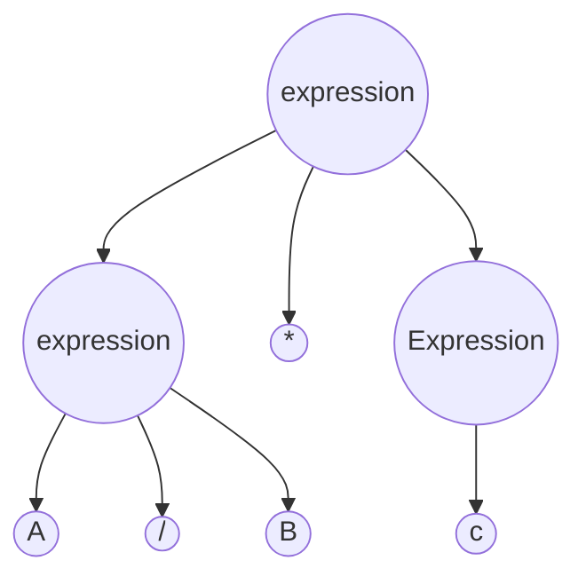

# Principles of Compiler Design
Authors: [[@ullman]] [[@aho]]
Publisher:  [[Addison-Wesley Publishing Co.]]

## Table of Contents
---
- Basic Structure of a Compiler
- Concepts and Terminology
- Lexical Analysis
- Finite-State Techniques
- Scanner Generator
- Parsers
	- Operator Prescedence
	- Recursive Descent
	- LR Parsing
- Code Generation
- Arrays and Structs
- Symbol Tables
- Run Time
- Error Recovery
- Code Optimization

## Introduction
---
_About the authors_

Sufficent material tought at Princeton for elementry compiler course and [automata](https://online.stanford.edu/courses/soe-ycsautomata-automata-theory) and language [theory](http://aduni.org/courses/theory/index.php?view=cw).

*Keyterms to define*
_translator_
_compiled_
_intermediate code_
_interpreter_
_command languages_
_assembler_
_preprocessor_
_Macro_
_Lexical Analyzer_
_expression_
_table management_
_error handler_
_symbol table_
_tokens_
_parse tree_
_context-free grammar_

Why do we need Translators?

```mermaid

lexical Analysis -> Table Management
lexical Analysis -> Syntax Analysis
lexical Analysis -> Error Handeling 

Syntax Analysis -> Error Handeling 
Syntax Analysis -> Table Management 

Code Generation -> Error Handeling 
Code Generation -> Table Management 

Code Generation -> Code Optimization
Code Optimization -> Code Generation

Code Generation -> .output
```
Fig 1.2 Phases of a Compiler

### Lexical Analysis
interface between source code and the compiler 
Creating a sequence of tokens that represent identifiers, keywords, constants, operators, and syntactical elements such as punctation, braces, semicolons.

### Syntax Analysis

_Figure 1.4 Example of a parser tree. Evaluating for a/b*c_

_figure 1.5_ Evaluating if/else statements