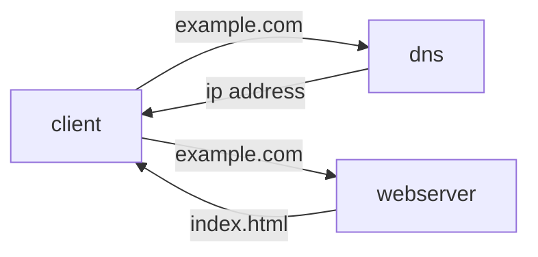
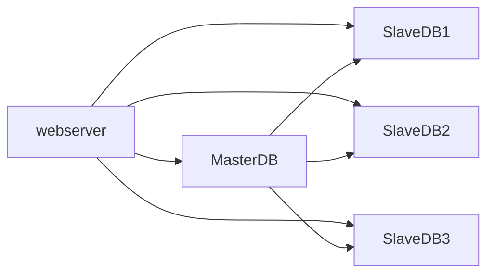
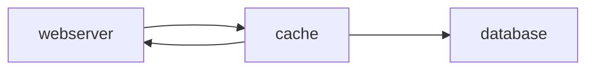
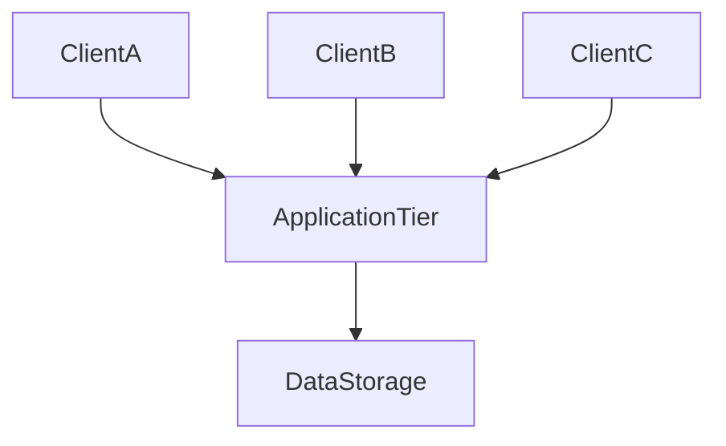

Status: #reading
Tags: #systems 
Content-Type: Text/Book
Source: https://ipfs.io/ipfs/bafykbzacecpbuvilbmokyl2ajs2hbve3qaut4h3vtir6htydecy2h5jaqmy7i?filename=Alex%20Yu%20-%20System%20Design%20Interview_%20An%20Insider%E2%80%99s%20Guide-Independently%20published%20%282020%29.pdf

# SCALE FROM ZERO TO MILLIONS OF USERS
**Single Server Setup** A starting point where everything is running on one server, Web app, database, cache.

Figure 1.1 single server setup


*how dns works* User access a website such as <example.com>, the domain name system provided by a third party returns an IP address to the user. With an IP address an HTTP request can be sent directly to the example web server. user receieve a response from server with the content.

**Database**
 Seperating the application tier and the data tier allows them to be scaled independantly
 
Firgure 1.3 Introducting Database
```mermaid
graph LR
 client --example.com--> dns
 dns -- ipaddress --> client
 client --example.com--> webserver 
 webserver -- index.html --> client 
 webserver --crud--> database
 database --return data--> webserver
 ```

 Non Relational Database may be a good choice if
 - requires low latency
 - data is unstructured (relation model does not apply)
 - only need to serialize/deserialize data
 - store a large amount of data

**Vertical vs Horizontal Scaling**
Vertical scaling is physically limited to the hardware we current have.
Scaling out (horizontal scaling) is preferable for large scale applications, adding more servers to your resource pool.

Scaling Databases  can be done by sharding

**Load Balancer**
```mermaid
graph LR

client ----> DNS
client --public.ip--> Load Balancer
LoadBalancer --private-ip--> Server1
LoadBalancer --private-ip--> Server2
```

Spread the workload across two web servers using a load balancer

**Database replication**
Database replication leads to better performance, Reliability, and High Availability.



**Caching**
Cache tier can be a temporary storage the 


typical cache api
```python
cache.set('mykey','hithere',3600*SECONDS)
cache.get('mykey')
```

caching is stored in volitile memory, remember its important to write this to a persistant data store. *Expiration policy* will cause the cache to reload data from the database. *Eviction policy* will evaluate what to remove from cache when memory is full.

**Content Delivery Network**
Dynamic content caching can take static content and host it physically closer to an users. 
Generally cost is the prohibitive factor in CDN's, Akami and Amazon's CloudFront service is paid by data transfer. 

**stateful architecture**
A stateful server remembers client data + state from one request to the next. The issue with stateful architecture is that user data must be requested from the same server. This is typically solved with *sticky sessions*.  

in a *stateless* architecture requests can be sent to any web server where the user data is stored in a shared data store.



*traffic re-direction* can be solved with GeoDNS rules that can re-direct traffic based on where they are located.

**Messages Queues**
Message queues supports asynchonus communictaion. Input services are called producers/publishers that create messages and publish them to a queue. Other services consume/subscribe to the queue to process them.

Message queues are a common form of decoupling services

**Database Scaling**
As your database grows you will need to switch to vertical sharding. 

Sharding can split the data set across a number of data servers. This introduces a few challenges for user look up, we need to know where the data is located. This can be resolved by a hashing function, with hashing we can know where to lookup data and what server its on.

*Resharding Data* When a single shard can no longer hold the data. which can be solved  with *consistent hashing*

*Celebrity Problem* Some records require more reads and have unique scaling issues.

## Search auto complete engine
design top 'k' pattern
[[Trie - Design Pattern]]

Update Trie based on data collection to aggragate new results, this could be done nightly.
Perssistant Trie storage can be either document storage (mongodb) or a Key-Value database.

## Design Youtube
Directed Acyclic graph

Resource management and Task Queue

Pre-signed upload urls or Shared Access Signature (azure)

## Design Google Drive

---
Annotated Refrences (from book)
[1](https://blog.teamtreehouse.com/should-you-go-beyond-relational-databases) [[beyond relational databases]]

---
https://jojozhuang.github.io/tutorial/creating-data-structure-diagrams-with-mermaid/
