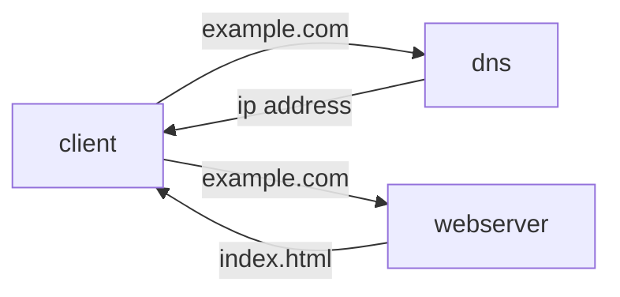

# SCALE FROM ZERO TO MILLIONS OF USERS
**Single Server Setup** A starting point where everything is running on one server, Web app, database, cache.

Figure 1.1 single server setup


*how dns works* User access a website such as <example.com>, the domain name system provided by a third party returns an IP address to the user. With an IP address an HTTP request can be sent directly to the example web server. user receieve a response from server with the content.

**Database**
 Seperating the application tier and the data tier allows them to be scaled independantly
 
Firgure 1.3 Introducting Database
```mermaid
graph LR
 client --example.com--> dns
 dns -- ipaddress --> client
 client --example.com--> webserver 
 webserver -- index.html --> client 
 webserver --crud--> database
 database --return data--> webserver
 ```

 Non Relational Database may be a good choice if
 - requires low latency
 - data is unstructured (relation model does not apply)
 - only need to serialize/deserialize data
 - store a large amount of data

**Vertical vs Horizontal Scaling**
Vertical scaling is physically limited to the hardware we current have.
Scaling out (horizontal scaling) is preferable for large scale applications, adding more servers to your resource pool.

