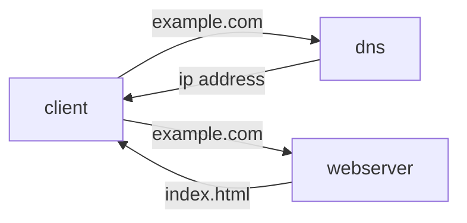

# SCALE FROM ZERO TO MILLIONS OF USERS


Figure 1.1 single server setup


<iframe frameborder="0" style="width:100%;height:183px;" src="https://viewer.diagrams.net/?tags=%7B%7D&highlight=0000ff&edit=_blank&layers=1&nav=1#R3VjbctowEP0aHtuxLG55DCSlnWk7yeSh4VGxha2psKgssMnXd4UlXyGmXELKCyOd1a6loz3aHTp4PE8nkizCH8KnvOM6ftrBdx3XHQwd%2BNXAOgMQ6hkkkMw3WAE8sVdqQLtsyXwaVxYqIbhiiyroiSiinqpgREqRVJfNBK9%2BdUEC2gCePMKb6C%2FmqzBDh%2FYUGv9KWRDaLyPHWObELjZAHBJfJCUI33fwWAqhstE8HVOuybO8ZH5fdljzjUkaqX0cHr6F6%2BTnhP95nN0P0slo%2Bpi8fnKzKCvCl%2BbAZrNqbRmQYhn5VAdxOniUhEzRpwXxtDWBOwcsVHMOMwRDE45KRdOd%2B0T56SFtqJhTJdewxDpYwkzKuH0zTwr%2B8zVhiXu7jpgrD%2FLQBSswMMT8A0m4QdIyprJBFBwZdjKKlRS%2F6VhwIQGPRATm0YxxXoNKrM1EpEzqu107N4G1XfPJICdvOQsiwObM97VxRAzgAbewo9Pwj2v8D7bw72zhv3su%2FvvtSUoj%2F1arXXPBSRwzr8pwNYkzd%2Bo3pN%2FKkaScKLaq%2Bm07sHF9EAwi5tzmHNW5tSFisZQeNV5lMdcC4bZAisiAqkagDf%2F5eQ6%2FkkHjSr6TF%2F301%2B8FOM4scAc0Zq%2FkZWNyqtfTyOOdGV957U2w4o1tSfzd2XXETR%2BV2rbMnS634bBy%2FWxMm8lUWz4PenZ%2Bl5aX3q3tLGXquTQuu8G08NIT67SvkuBAm8x%2BiwrzzGaZ21azTi5NXHv2sNM7TJrdm1qgm%2FeVJkLXo03kHHnXx4mz2R0l9EWTSOVqSwNw6U4JDy%2FdKaFmq3RxlnDvo%2FWTqLuFpT7XzaPPVjAMNsMotih8pWRoMHoljSfuf7TGEw3PVp3LBXlaqcct1bmoyFNb5N%2BjOrt7Fmd0nurs1p86fGjj7LQEOnd1vrmi6jy8ZHV296g1B4vTrYgT7S1OtyxO573EifZV53nEWWt4u8MDtYnaAp1Zm26zLv%2B32szUcXptwrT4yzIjvvjjF9%2F%2FBQ%3D%3D"></iframe>

Firgure 1.3 Introducting Database
```mermaid
graph LR
 client --example.com--> dns
 dns -- ipaddress --> client
 client --example.com--> webserver 
 webserver -- index.html --> client 
 webserver --crud--> database
 database --return data--> webserver
 ```
 ![[Pasted image 20211011134133.png]]
 
 