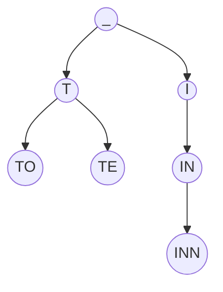
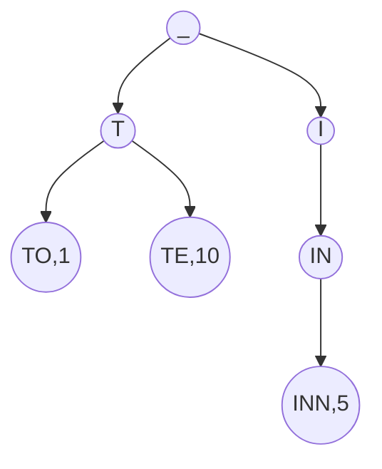

Based on information retrieval where each addition letter creates a branch in the tree.

```mermaid
graph TB

    A((_))-->B((T))

    A-->C((I));

    B-->E((TO))

    B-->F((TE))

    C-->H((IN))

    H-->I((INN))

```

Each node can have an arbitraty value assigned to it.

```mermaid
graph TB

    A((_))-->B((T))

    A-->C((I));

    B-->E((TO,1))

    B-->F((TE,10))

    C-->H((IN))

    H-->I((INN,5))

```